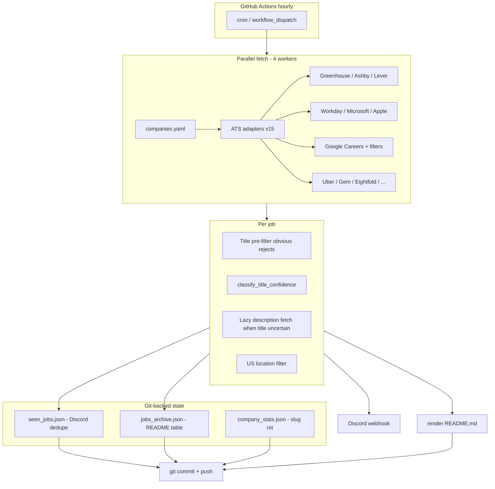

# Serverless ATS Job Sniper — Technical Documentation

> The user-facing [README.md](README.md) is auto-generated each run: open positions,
> stats, and apply links. This document covers architecture, filtering strategy,
> evaluation results, and the full company registry.

Hourly pipeline that queries **public** job-board APIs (no login), filters for
early-career technical roles, deduplicates with git-backed JSON state, notifies
Discord, and commits updated state back to the repo. **Zero servers, zero database.**

---

## Architecture



### Pipeline (one run)

1. **Load** `companies.yaml` (96 entries: **74 active**, 22 `tier3_todo`).
2. **Fetch** all active companies in parallel (`ATS_SNIPER_FETCH_WORKERS`, default 4).
   - Log `Company: fetched N postings` as each company completes.
   - Optional caps: `ATS_SNIPER_MAX_LIST_PAGES`, `ATS_SNIPER_MAX_JOBS_PER_COMPANY` (set in CI).
3. **Classify** every posting: regex on title (+ description when fetched).
4. **US filter** (default on; `ATS_SNIPER_ALL_LOCATIONS=1` disables).
5. **Archive** all matches into `jobs_archive.json` (drives README; tracks closed roles).
6. **Discord** only for URLs not in `seen_jobs.json`; mark seen after notify.
7. **Prune** `seen_jobs.json` entries older than 90 days.
8. **Regenerate** `README.md`, write `latest_jobs.md`, commit state files.

Per-company failures are isolated (logged + skipped); one broken slug does not abort the run.

---

## Strategies

### 1. ATS adapters (breadth)

| ATS | Adapter | Active companies | Fetch pattern |
|-----|---------|------------------|---------------|
| Greenhouse | `greenhouse.py` | 30 | Single JSON list (`?content=true`) |
| Ashby | `ashby.py` | 27 | Single public API |
| Lever | `lever.py` | 4 | Single JSON list |
| Google Careers | `google_careers.py` | 4 | Paginated HTML embedded JSON |
| Workday | `workday.py` | 2 | POST pagination (20/page) |
| Gem | `gem.py` | 3 | GraphQL job board |
| Microsoft | `microsoft.py` | 1 | PCSX search API (50/page) |
| Apple | `apple.py` | 1 | HTML search pages |
| Uber | `uber.py` | 1 | Careers search API |
| Eightfold | `eightfold.py` | 1 | Batched JSON (Netflix) |
| Workable | `workable.py` | 1 | Widget API |
| Rippling | `rippling.py` | 1 | Public jobs API |
| SmartRecruiters | `smartrecruiters.py` | 1 | Offset pagination |
| Jibe | `jibe.py` | 1 | Paginated JSON |
| LinkedIn | `linkedin.py` | 1 | Guest search API |

`meta` adapter exists in code but **Meta** remains `tier3_todo` in the registry (rate limits on cold bootstrap).

### 2. Regex classifier (`filters.py`)

Two-stage logic:

- **`should_fetch_description(title)`** — skip per-job detail HTTP when title-only classification is already decisive (major speed win on Google/Microsoft/Workday).
- **`classify_title_confidence(title, description)`** — include/exclude with reasons (open-level IC, intern, new grad, MTS, HFC fellowships, non-tech intern exclusions, etc.).

**Include signals (examples):** intern, new grad, university graduate, early career, campus, PhD early-career tracks, open-level SWE titles without senior YOE in description.

**Hard excludes (examples):** senior, staff, principal, director, manager, VP, non-technical intern titles, expert/HFC fellowships misclassified as EC.

**US locations:** `is_us_location()` + optional description fallback; ambiguous locations can pass through for manual review.

### 3. Google Careers sidebar filters

Unfiltered Google search is ~**4,000** jobs (~200 pages). Production uses the same URL params as the careers UI:

```text
target_level=EARLY
target_level=INTERN_AND_APPRENTICE
sort_by=date
```

Configured in `companies.yaml` under `google_target_levels` / `google_sort_by`. Reduces the Google board to ~**440** jobs (~22 pages) while keeping full EC/intern coverage on that filtered catalog.

Other `google_careers` entries use `google_company` (DeepMind, Waymo, Isomorphic Labs).

### 4. GitHub Actions performance

| Setting | Value | Purpose |
|---------|-------|---------|
| `timeout-minutes` | 45 | Avoid 20m kill mid-run (fetch + classify all companies) |
| `ATS_SNIPER_FETCH_WORKERS` | 4 | Parallel company fetch |
| `ATS_SNIPER_MAX_LIST_PAGES` | 60 | Cap Google/Microsoft/Workday/Apple list depth in CI |
| `ATS_SNIPER_MAX_JOBS_PER_COMPANY` | 1200 | Cap single-response megaboards (e.g. Anduril ~1.9k) |
| `ATS_SNIPER_RESET_STATE` | — | Set to `1` (or use workflow **reset_state**) to wipe `seen_jobs.json`, `jobs_archive.json`, and `company_stats.json` before the run |

### 5. State and deduplication

| File | Role |
|------|------|
| `seen_jobs.json` | URL → first-seen time; Discord only fires on new URLs |
| `jobs_archive.json` | All matched jobs ever seen; `is_closed` when URL disappears from a later scrape |

**Fresh start:** Run Actions → **ATS Sniper** → **Run workflow** with **reset_state** checked, or locally `ATS_SNIPER_RESET_STATE=1 python scraper.py`. That clears old README rows and re-notifies every current match once (Discord summary if &gt;50).
| `company_stats.json` | Per-company posting/match counts; **slug-rot** warning if matches drop to zero |
| `latest_jobs.md` | Human-readable log of the latest Discord batch |

---

## Results so far

### Production (live scraper)

From the latest committed [README.md](README.md) stats (updates every hourly run):

| Metric | Value |
|--------|-------|
| Open positions (US EC matches in archive) | **251** |
| All-time URLs tracked in archive | **252** |
| Active companies in registry | **74** |
| Last README update | 2026-05-21 17:14 UTC |

Discord alerts only fire for **new** URLs (not already in `seen_jobs.json`). After warm-up, hourly noise drops sharply.

**Operational note:** Early GHA runs hit the 20-minute timeout while processing ~4k Google + ~2k Anduril-class boards. Recent changes (45m timeout, Google EC filters, list/job caps, fetch logging) target a full 79-company pass each hour.

### Manual eval vs regex (`testing/eval/`)

Rigorous manual labels on **5,393** fetched jobs (up to ~100/company sample), merged in `cursor_eval_labels.jsonl`:

| Metric | Regex vs manual |
|--------|-----------------|
| Accuracy | **98.7%** |
| Precision | **81.3%** (31 FP) |
| Recall | **76.3%** (42 FN) |
| F1 | **0.79** |
| Manual includes (ground truth) | 177 (3.3% of jobs) |

**Recent filter changes:** exclude mid-level ladder titles (Engineer II/III, L4+), tighten `open-level technical ic` to require real EC signals in requirements, and tag education from the qualifications section (student vs degree-required vs new grad).

**Remaining false positives (31):** mostly `explicit ec technical` / `implicit ec technical` on experienced IC titles (Research Scientist, Quant Researcher) whose descriptions have strong entry-level signals but whose titles don't say "new grad / intern". Also bare SWE titles at companies like Snowflake/Discord where the description implies new-grad but the title is level-less.

**Remaining false negatives (42):** (a) Engineer II/III and Software Engineer 3 across Pinterest, MongoDB, Google — excluded by experienced-level title guard but sometimes used for new-grad cohorts; (b) non-technical EC roles (ops, finance, talent interns) that fall outside the tech-domain scope; (c) forward-deployed / support-engineer edge cases; (d) postdoctoral fellows at ML companies, intentionally excluded as out-of-scope for new-grad targeting.

Re-run scoring after filter changes:

```bash
python testing/scripts/_cursor_manual_eval.py rescore
python testing/scripts/_cursor_manual_eval.py score
```

---

## Company registry and job board links

Source of truth: [`companies.yaml`](companies.yaml). Regenerate this table after registry edits:

```bash
python scripts/company_portal_links.py
```

### Active companies (74)

<!-- 74 active, 22 tier3_todo -->
| Company | Category | ATS | Job board |
|---------|----------|-----|-----------|
| Adobe | big_tech | `workday` | [Open board](https://adobe.wd5.myworkdayjobs.com/en-US/external_experienced) |
| Airbnb | big_tech | `greenhouse` | [Open board](https://boards.greenhouse.io/airbnb) |
| Apple | big_tech | `apple` | [Open board](https://jobs.apple.com/en-us/search) |
| Atlassian | big_tech | `smartrecruiters` | [Open board](https://careers.smartrecruiters.com/Atlassian) |
| Datadog | big_tech | `greenhouse` | [Open board](https://boards.greenhouse.io/datadog) |
| Discord | big_tech | `greenhouse` | [Open board](https://boards.greenhouse.io/discord) |
| DoorDash | big_tech | `greenhouse` | [Open board](https://boards.greenhouse.io/doordashusa) |
| Google | big_tech | `google_careers` | [Open board](https://www.google.com/about/careers/applications/jobs/results?target_level=EARLY&target_level=INTERN_AND_APPRENTICE&sort_by=date) |
| LinkedIn | big_tech | `linkedin` | [Open board](https://www.linkedin.com/jobs/search/) |
| Microsoft | big_tech | `microsoft` | [Open board](https://apply.careers.microsoft.com/careers) |
| MongoDB | big_tech | `greenhouse` | [Open board](https://boards.greenhouse.io/mongodb) |
| Netflix | big_tech | `eightfold` | [Open board](https://explore.jobs.netflix.net) |
| Palantir | big_tech | `lever` | [Open board](https://jobs.lever.co/palantir) |
| Pinterest | big_tech | `greenhouse` | [Open board](https://boards.greenhouse.io/pinterest) |
| Reddit | big_tech | `greenhouse` | [Open board](https://boards.greenhouse.io/reddit) |
| Roblox | big_tech | `greenhouse` | [Open board](https://boards.greenhouse.io/roblox) |
| Snowflake | big_tech | `ashby` | [Open board](https://jobs.ashbyhq.com/snowflake) |
| Uber | big_tech | `uber` | [Open board](https://www.uber.com/careers/list/) |
| Benchling | biotech | `ashby` | [Open board](https://jobs.ashbyhq.com/benchling) |
| Click Therapeutics | biotech | `greenhouse` | [Open board](https://boards.greenhouse.io/clicktherapeutics) |
| EvolutionaryScale | biotech | `greenhouse` | [Open board](https://boards.greenhouse.io/biohub) |
| Flatiron Health | biotech | `greenhouse` | [Open board](https://boards.greenhouse.io/flatironhealth) |
| Genesis Therapeutics | biotech | `ashby` | [Open board](https://jobs.ashbyhq.com/genesis) |
| Headway | biotech | `ashby` | [Open board](https://jobs.ashbyhq.com/headway) |
| Inceptive | biotech | `greenhouse` | [Open board](https://boards.greenhouse.io/inceptive) |
| Insitro | biotech | `ashby` | [Open board](https://jobs.ashbyhq.com/insitro) |
| Isomorphic Labs | biotech | `google_careers` | [Open board](https://www.google.com/about/careers/applications/jobs/results?company=Isomorphic+Labs) |
| Pathos AI | biotech | `ashby` | [Open board](https://jobs.ashbyhq.com/pathos) |
| Recursion Pharma | biotech | `greenhouse` | [Open board](https://boards.greenhouse.io/recursionpharmaceuticals) |
| Xaira Therapeutics | biotech | `greenhouse` | [Open board](https://boards.greenhouse.io/xairatherapeutics) |
| Zocdoc | biotech | `greenhouse` | [Open board](https://boards.greenhouse.io/zocdoc) |
| Clay | enterprise | `ashby` | [Open board](https://jobs.ashbyhq.com/claylabs) |
| ClickHouse | enterprise | `greenhouse` | [Open board](https://boards.greenhouse.io/clickhouse) |
| Cognition AI | enterprise | `ashby` | [Open board](https://jobs.ashbyhq.com/cognition) |
| Confluent | enterprise | `ashby` | [Open board](https://jobs.ashbyhq.com/confluent) |
| Databricks | enterprise | `greenhouse` | [Open board](https://boards.greenhouse.io/databricks) |
| ElevenLabs | enterprise | `ashby` | [Open board](https://jobs.ashbyhq.com/elevenlabs) |
| Etched | enterprise | `ashby` | [Open board](https://jobs.ashbyhq.com/etched) |
| Figma | enterprise | `greenhouse` | [Open board](https://boards.greenhouse.io/figma) |
| Hebbia | enterprise | `ashby` | [Open board](https://jobs.ashbyhq.com/hebbia-ai) |
| Linear | enterprise | `ashby` | [Open board](https://jobs.ashbyhq.com/linear) |
| Notion | enterprise | `ashby` | [Open board](https://jobs.ashbyhq.com/notion) |
| Plaid | enterprise | `ashby` | [Open board](https://jobs.ashbyhq.com/plaid) |
| Ramp | enterprise | `ashby` | [Open board](https://jobs.ashbyhq.com/ramp) |
| Retool | enterprise | `gem` | [Open board](https://jobs.gem.com/retool) |
| Rippling | enterprise | `rippling` | [Open board](https://ats.rippling.com/rippling/jobs) |
| Runway ML | enterprise | `ashby` | [Open board](https://jobs.ashbyhq.com/runway-ml) |
| Sierra | enterprise | `ashby` | [Open board](https://jobs.ashbyhq.com/sierra) |
| Stripe | enterprise | `greenhouse` | [Open board](https://boards.greenhouse.io/stripe) |
| Together AI | enterprise | `greenhouse` | [Open board](https://boards.greenhouse.io/togetherai) |
| Vercel | enterprise | `greenhouse` | [Open board](https://boards.greenhouse.io/vercel) |
| Warp | enterprise | `ashby` | [Open board](https://jobs.ashbyhq.com/warp) |
| Anthropic | frontier_ai | `greenhouse` | [Open board](https://boards.greenhouse.io/anthropic) |
| Cohere | frontier_ai | `ashby` | [Open board](https://jobs.ashbyhq.com/cohere) |
| CoreWeave | frontier_ai | `greenhouse` | [Open board](https://boards.greenhouse.io/coreweave) |
| Cursor | frontier_ai | `ashby` | [Open board](https://jobs.ashbyhq.com/cursor) |
| Glean | frontier_ai | `greenhouse` | [Open board](https://boards.greenhouse.io/gleanwork) |
| Google DeepMind | frontier_ai | `google_careers` | [Open board](https://www.google.com/about/careers/applications/jobs/results?company=DeepMind) |
| Groq | frontier_ai | `gem` | [Open board](https://jobs.gem.com/groq) |
| Harvey | frontier_ai | `ashby` | [Open board](https://jobs.ashbyhq.com/harvey) |
| Hugging Face | frontier_ai | `workable` | [Open board](https://apply.workable.com/huggingface) |
| Lambda Labs | frontier_ai | `ashby` | [Open board](https://jobs.ashbyhq.com/lambda) |
| LangChain | frontier_ai | `ashby` | [Open board](https://jobs.ashbyhq.com/langchain) |
| Nvidia | frontier_ai | `workday` | [Open board](https://nvidia.wd5.myworkdayjobs.com/en-US/NVIDIAExternalCareerSite) |
| Perplexity AI | frontier_ai | `ashby` | [Open board](https://jobs.ashbyhq.com/perplexity) |
| Pinecone | frontier_ai | `ashby` | [Open board](https://jobs.ashbyhq.com/pinecone) |
| Scale AI | frontier_ai | `greenhouse` | [Open board](https://boards.greenhouse.io/scaleai) |
| DRW | quant | `greenhouse` | [Open board](https://boards.greenhouse.io/drweng) |
| Point72 | quant | `greenhouse` | [Open board](https://boards.greenhouse.io/point72) |
| Anduril | robotics | `greenhouse` | [Open board](https://boards.greenhouse.io/andurilindustries) |
| Figure AI | robotics | `greenhouse` | [Open board](https://boards.greenhouse.io/figureai) |
| Luma AI | robotics | `gem` | [Open board](https://jobs.gem.com/lumalabs-ai) |
| Physical Intelligence | robotics | `ashby` | [Open board](https://jobs.ashbyhq.com/physicalintelligence) |
| Waymo | robotics | `google_careers` | [Open board](https://www.google.com/about/careers/applications/jobs/results?company=Waymo) |

### Tier 3 - tracked, not scraped yet (22)

| Company | Category | Notes |
|---------|----------|-------|
| Balyasny Asset Mgt. | quant | Salesforce Experience Cloud at bambusdev.my.site.com - guest auth token required. |
| Bloomberg | quant | Custom careers site at careers.bloomberg.com - blocks automated access. |
| Citadel | quant | Bespoke careers portal at citadel.com/careers. |
| Citadel Securities | quant | Bespoke careers portal at citadelsecurities.com/careers. |
| D.E. Shaw | quant | Custom careers site at deshaw.com/careers. |
| Five Rings | quant | Custom careers site at fiverings.com/careers. |
| HRT | quant | Custom careers site at hudsonrivertrading.com/careers. |
| Headlands Technologies | quant | Custom careers site at headlandstech.com/careers. |
| IMC Trading | quant | Custom careers site at imc.com/us/careers. |
| Jane Street | quant | Custom careers site at janestreet.com/join-jane-street. |
| Jump Trading | quant | Custom careers site at jumptrading.com/careers. |
| Meta | big_tech | Custom careers site at metacareers.com - meta adapter exists but rate-limited on bootstrap. |
| Millennium | quant | Custom careers site at mlp.com/careers. |
| OpenAI | frontier_ai | Custom careers site at openai.com/careers/search. |
| Optiver | quant | Custom careers site at optiver.com. |
| PDT Partners | quant | Custom careers site at pdtpartners.com. |
| Radix Trading | quant | Custom careers site at radixtrading.com. |
| SpaceX | robotics | Custom careers site at spacex.com/careers. |
| Tower Research | quant | Custom careers site at tower-research.com/open-positions. |
| Two Sigma | quant | Bespoke careers portal at careers.twosigma.com. |
| WorldQuant | quant | Custom careers site at worldquant.com/career-listing. |
| xAI | frontier_ai | Custom careers site at x.ai/careers - needs bespoke adapter. |

---

## Project layout

```
serverless-ats-sniper/
├── README.md                 # AUTO-GENERATED open positions table
├── README_TECH.md            # This file
├── scraper.py                # Orchestrator
├── fetch_limits.py           # CI list/job caps
├── companies.yaml            # Company registry
├── filters.py                # Regex + description signals
├── description_signals.py    # Requirement parsing helpers
├── classifier.py             # classify_job() wrapper
├── state.py / jobs_archive.py / company_stats.py
├── notifier.py / render_readme.py
├── discovery.py              # Slug verifier
├── review.py                 # Manual audit CLI
├── adapters/                 # Per-ATS fetch modules
├── testing/                  # Eval scripts + reports (see testing/README.md)
├── scripts/company_portal_links.py
└── .github/workflows/scraper.yml
```

---

## Setup

### 1. Fork or clone

```bash
git clone https://github.com/Agnikulu/Job-Postings.git
cd Job-Postings
pip install -r requirements.txt
```

### 2. Discord webhook

Server Settings → Integrations → Webhooks → New Webhook. Add URL as GitHub secret `DISCORD_WEBHOOK`.

### 3. Enable Actions

Repo **Settings → Actions → General**: enable workflows, grant **Read and write** to `GITHUB_TOKEN` (state commit step).

### 4. Verify slugs

```bash
python discovery.py
```

### 5. Run locally

```bash
# Dry-run (no DISCORD_WEBHOOK)
python scraper.py

export DISCORD_WEBHOOK="https://discord.com/api/webhooks/..."
python scraper.py
```

### 6. Tests

```bash
pytest -q
```

---

## Adding a company

1. Find the public careers API (DevTools → Network: `boards-api`, `ashbyhq`, `lever.co`, `myworkdayjobs`, etc.).
2. Add to `companies.yaml` with `ats`, `slug` (or Workday/Google fields).
3. `python discovery.py` → confirm OK.
4. Regenerate portal table: `python scripts/company_portal_links.py`.

### Google Careers optional fields

```yaml
- name: Google
  ats: google_careers
  google_target_levels:
    - EARLY
    - INTERN_AND_APPRENTICE
  google_sort_by: date
  google_location: United States   # optional
  google_q: software engineer      # optional search box
```

---

## Reliability notes

- **Cron jitter:** GitHub Actions hourly cron is best-effort (often +5–20 min).
- **Slug rot:** `company_stats.json` warns when a company goes from N matches to 0 with stable posting count.
- **State size:** `seen_jobs.json` pruned at 90 days; archive grows with open+closed history.
- **First run:** Cold `seen_jobs.json` can produce 50+ Discord matches → single summary embed with link to `latest_jobs.md`.

---

## Roadmap

- Greenhouse list fetch without full `content=true` for every job (Anduril-scale boards)
- Enable Meta with warmed `meta_title_cache.json` in repo
- Tier-3 quant/AI custom site adapters (OpenAI, Jane Street, etc.)
- Tighter open-level IC precision (eval-driven regex tweaks)
- Optional `google_location: United States` on main Google entry
