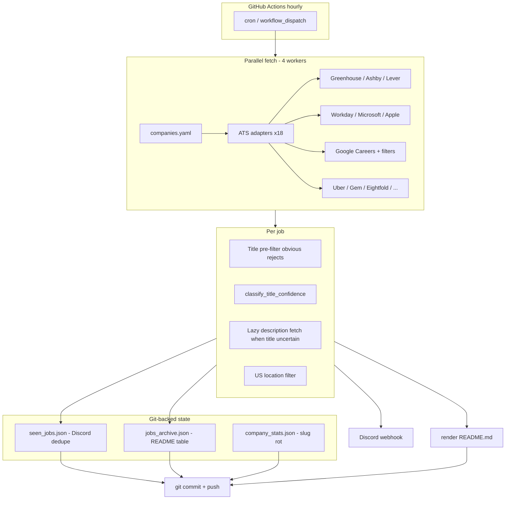

# Serverless ATS Job Sniper — Technical Documentation

> The user-facing [README.md](README.md) is auto-generated each run: open positions,
> stats, and apply links. This document covers architecture, filtering strategy,
> evaluation results, and the full company registry.

Hourly pipeline that queries **public** job-board APIs (no login), filters for
early-career technical roles, deduplicates with git-backed JSON state, notifies
Discord, and commits updated state back to the repo. **Zero servers, zero database.**

---

## Architecture


```mermaid
flowchart TB
  subgraph trigger [GitHub Actions hourly]
    CRON[cron / workflow_dispatch]
  end

  subgraph fetch [Parallel fetch - 4 workers]
    YAML[companies.yaml]
    ADAPT[ATS adapters x18]
    YAML --> ADAPT
    ADAPT --> GH[Greenhouse / Ashby / Lever]
    ADAPT --> WD[Workday / Microsoft / Apple]
    ADAPT --> GC[Google Careers + filters]
    ADAPT --> OTHER[Uber / Gem / Eightfold / ...]
  end

  subgraph classify [Per job]
    PRE[Title pre-filter obvious rejects]
    REGEX[classify_title_confidence]
    DESC[Lazy description fetch when title uncertain]
    US[US location filter]
  end

  subgraph state [Git-backed state]
    SEEN[seen_jobs.json - Discord dedupe]
    ARCH[jobs_archive.json - README table]
    STATS[company_stats.json - slug rot]
  end

  CRON --> fetch
  fetch --> classify
  classify --> SEEN
  classify --> ARCH
  classify --> DISCORD[Discord webhook]
  classify --> README[render README.md]
  SEEN --> COMMIT[git commit + push]
  ARCH --> COMMIT
  STATS --> COMMIT
  README --> COMMIT
```

### Pipeline (one run)

1. **Load** `companies.yaml` (**111 active** companies; no `tier3_todo` entries).
2. **Fetch** all active companies in parallel (`ATS_SNIPER_FETCH_WORKERS`, default 4).
   - Log `Company: fetched N postings` as each company completes.
   - Optional caps: `ATS_SNIPER_MAX_LIST_PAGES`, `ATS_SNIPER_MAX_JOBS_PER_COMPANY` (set in CI).
3. **Classify** every posting: regex on title (+ description when fetched).
4. **US filter** (default on; `ATS_SNIPER_ALL_LOCATIONS=1` disables).
5. **Archive** all matches into `jobs_archive.json` (drives README; tracks closed roles).
6. **Discord** only for URLs not in `seen_jobs.json`; mark seen after notify.
7. **Prune** `seen_jobs.json` entries older than 90 days.
8. **Regenerate** `README.md`, write `latest_jobs.md`, commit state files.

Per-company failures are isolated (logged + skipped); one broken slug does not abort the run.

---

## Strategies

### 1. ATS adapters (breadth)

| ATS | Adapter | Active companies | Fetch pattern |
|-----|---------|------------------|---------------|
| Greenhouse | `greenhouse.py` | 39 | Single JSON list (`?content=true`) |
| Ashby | `ashby.py` | 35 | Single public API |
| Lever | `lever.py` | 5 | Single JSON list |
| Google Careers | `google_careers.py` | 4 | Paginated HTML embedded JSON |
| Workday | `workday.py` | 5 | POST pagination (20/page) |
| LinkedIn | `linkedin.py` | 10 | Guest search API |
| Gem | `gem.py` | 3 | GraphQL job board |
| Recruitee | `recruitee.py` | 1 | Public offers API |
| Wiz | `wiz.py` | 1 | Next.js careers JSON proxy |
| Coinbase | `coinbase.py` | 1 | Careers REST API + GH fallback |
| Amazon Jobs | `amazon_jobs.py` | 1 | amazon.jobs search.json |
| Meta | `meta.py` | 1 | metacareers sitemap + title cache |
| Microsoft | `microsoft.py` | 1 | PCSX search API (50/page) |
| Apple | `apple.py` | 1 | HTML search pages |
| Uber | `uber.py` | 1 | Careers search API |
| Eightfold | `eightfold.py` | 1 | Batched JSON (Netflix) |
| Workable | `workable.py` | 1 | Widget API |
| Rippling | `rippling.py` | 1 | Public jobs API |
| SmartRecruiters | `smartrecruiters.py` | 1 | Offset pagination |
| Jibe | `jibe.py` | 1 | Paginated JSON |

**Meta** uses the `meta` adapter (metacareers.com jobs sitemap + title cache). Requires browser headers (not `DEFAULT_HEADERS`). Some networks/datacenter IPs get HTTP 400 from metacareers; when that happens and `linkedin_company_id` is set, fetch falls back to LinkedIn (`10667` for Meta). After the first block, `meta_careers_state.json` skips the sitemap probe on later runs.

**HTTP performance:** List/detail adapters reuse `requests.Session` (TCP/TLS). Amazon Jobs fetches search pages in parallel when the API reports `hits`. Workday/LinkedIn detail fetches use per-thread sessions during parallel description enrichment.

**Amazon Jobs** (`amazon_jobs`) hits `amazon.jobs/en/search.json`. AWS entry uses `amazon_query: Amazon Web Services` (~5k roles). Retail Amazon could use the same adapter without a query.

**Tesla** has no public JSON/Greenhouse board; `tesla.com/careers` returns 403 (Akamai). Stays on LinkedIn (`15564`).

**Wiz** uses a custom adapter against `wiz.io/api/fetch-jobs-data`.

**Coinbase** uses a custom adapter against `coinbase.com/api/v2/careers` (falls back to private Greenhouse slug `cdpjobs`). Both endpoints are currently returning errors from Coinbase's side; the adapter is wired for when they recover.

### 2. Regex classifier (`filters.py` + `classifier.py`)

Pipeline entry point: **`classify_job()`** in `classifier.py` (prefilter → `classify_title_confidence` → education tags → US gate).

Two-stage logic in `filters.py`:

- **`is_obvious_reject(title)`** — conservative title prefilter (`_OBVIOUS_NON_TECH` checked before `_PREFILTER_NEVER_REJECT` so `Junior Clinical…` is not saved by `junior`).
- **`should_fetch_description(title)`** — skip per-job detail HTTP when title-only classification is already decisive (major speed win on Google/Microsoft/Workday).
- **`classify_title_confidence(title, description)`** — include/exclude with reasons (open-level IC, intern, new grad, MTS, HFC fellowships, non-tech intern exclusions, etc.).

**Include signals (examples):** intern, new grad, university graduate, early career, campus, PhD early-career tracks, open-level SWE titles only when description has EC/YOE signals (not bare `2026` in title alone).

**Hard excludes (examples):** senior, staff, principal, director, manager, VP, non-technical intern titles, expert/HFC fellowships, experienced ladder titles (Engineer II/III, Scientist II, Level 4+, P2–P9) even when title also says `Graduate 2026`, safe non-tech prefilter hits (counsel, equipment technician, quant portfolio analyst, operations associate, etc.).

**US locations:** `is_us_location()` + optional description fallback; ambiguous `Remote` / `N Locations` return false in strict mode.

**Education tags (`education.py`):** requirements-first tags (Intern, New Grad, Early Career for Engineer I, degree paths). `is_hard_experienced_ladder(title)` suppresses all tags on mid-level cohort branding (e.g. `Graduate 2026 … Engineer II`).

**Posted dates (`date_parser.py`):** normalizes ATS fields to `YYYY-MM-DD`. Greenhouse/Lever/Ashby use publish timestamps (`first_published`, `publishedAt`, `createdAt`), not last-updated. LinkedIn/Workday list cards often use relative text (`2 days ago`) recomputed each run; archive `upsert` keeps the **earliest** parsed `posted_date` so hourly scrapes do not push old jobs to today. Missing dates fall back to `first_seen` in the README.

### 3. Google Careers sidebar filters

Unfiltered Google search is ~**4,000** jobs (~200 pages). Production uses the same URL params as the careers UI:

```text
target_level=EARLY
target_level=INTERN_AND_APPRENTICE
sort_by=date
```

Configured in `companies.yaml` under `google_target_levels` / `google_sort_by`. Reduces the Google board to ~**440** jobs (~22 pages) while keeping full EC/intern coverage on that filtered catalog.

Other `google_careers` entries use `google_company` (DeepMind, Waymo, Isomorphic Labs).

### 4. GitHub Actions performance

| Setting | Value | Purpose |
|---------|-------|---------|
| `timeout-minutes` | 59 | Avoid killing long runs mid-scrape (fetch + classify all companies) |
| `ATS_SNIPER_FETCH_WORKERS` | 8 | Parallel company fetch (non-LinkedIn only; LinkedIn is always serial) |
| `ATS_SNIPER_LINKEDIN_DELAY_SEC` | 10 (CI) / 6 (local default) | Pause between LinkedIn company fetches |
| `ATS_SNIPER_LINKEDIN_PAGE_DELAY_SEC` | 1.0 (CI) / 0.75 (local default) | Pause between LinkedIn search pages |
| `ATS_SNIPER_EVAL_FETCH_WORKERS` | 4 | Parallel workers for eval fetch (non-LinkedIn) |
| `ATS_SNIPER_MAX_LIST_PAGES` | 60 | Cap Google/Microsoft/Workday/Apple list depth in CI |
| `ATS_SNIPER_MAX_JOBS_PER_COMPANY` | 1200 | Cap single-response megaboards (e.g. Anduril ~1.9k) |
| `ATS_SNIPER_RESET_STATE` | — | Set to `1` (or use workflow **reset_state**) to wipe `seen_jobs.json`, `jobs_archive.json`, and `company_stats.json` before the run |

**LinkedIn HTTP 429:** The guest jobs API rate-limits aggressively when many companies are hit at once. The scraper fetches all `linkedin` registry entries **one at a time** with backoff on 429. If you still see warnings, wait 15–30 minutes, re-run, or raise `ATS_SNIPER_LINKEDIN_DELAY_SEC` (e.g. `10`). For eval LinkedIn backfill only: `python testing/scripts/_retry_linkedin_eval.py` (8s between companies).

### 5. State and deduplication

| File | Role |
|------|------|
| `seen_jobs.json` | URL → first-seen time; Discord only fires on new URLs |
| `jobs_archive.json` | All matched jobs ever seen; `is_closed` when URL disappears from a later scrape |
| `company_stats.json` | Per-company posting/match counts; **slug-rot** warning if matches drop to zero |
| `latest_jobs.md` | Human-readable log of the latest Discord batch |

**Archive self-heal:** Each run only `upsert`s URLs that still pass classify. Jobs that no longer match are not touched that run; `close_unseen()` marks them `is_closed` when their company is scraped successfully. README open table drops them on the next render.

**Fresh start:** Run Actions → **ATS Sniper** → **Run workflow** with **reset_state** checked, or locally `ATS_SNIPER_RESET_STATE=1 python scraper.py`. That clears old README rows and re-notifies every current match once (Discord summary if &gt;50).

---

## Results so far

### Production (live scraper)

From the latest committed [README.md](README.md) stats (updates every hourly run):

| Metric | Value |
|--------|-------|
| Open positions (US EC matches in archive) | **251** |
| All-time URLs tracked in archive | **252** |
| Active companies in registry | **102** |
| Last README update | 2026-05-21 17:14 UTC |

Discord alerts only fire for **new** URLs (not already in `seen_jobs.json`). After warm-up, hourly noise drops sharply.

**Operational note:** Early GHA runs hit the 20-minute timeout while processing ~4k Google + ~2k Anduril-class boards. Recent changes (45m timeout, Google EC filters, list/job caps, fetch logging) target a full 102-company pass each hour.

### Manual eval vs regex (`testing/eval/`)

**Authoritative accuracy set:** `testing/eval/eval_gold.jsonl` (2455 rows) — independently hand-labeled against `testing/eval/RUBRIC.md`, real postings fetched live across all 137 companies and every non-LinkedIn ATS type (four fetch rounds, ~86,600 postings sampled total, the last two uncapped/full fetches per company), stratified toward regex-positive and known-hard-boundary categories (MTS, cohort-branded ladder titles, post-training research, associate titles, forward-deployed engineer, open-level IC, SpaceX-style titles, physical design/network engineer) plus a baseline sample of easy cases. Labeling never imports from `filters.py`/`description_signals.py` — see the **Governance** note below for why that independence matters.

| Metric (`eval_gold.jsonl`, 2455 rows) | Value |
|---------------------------------------|-------|
| Precision (regex+) | **74.7%** (619 TP / 829 regex-positive) |
| Recall | **93.8%** (measurement caveat below) |
| FP / FN | 210 / 41 |

Precision here is well-measured — the gold set includes essentially every regex-positive job found while sampling ~86,600 live postings. **Recall is not well-measured in general** (see caveat below); the sample still deliberately concentrates on regex-positive and known-hard-exclude categories rather than randomly sampling the huge "obvious reject" population, so treat the recall floor as a regression tripwire on this specific set, not a production recall estimate. Full detail in `testing/eval/eval_baseline.json`'s `note` field, including the full history of all five rounds' numbers.

Floor + regression checks (both run in CI on every PR/push touching `**.py` — `.github/workflows/tests.yml`):

```bash
pytest tests/test_eval_metrics_floor.py -q   # aggregate precision/recall vs eval_baseline.json
pytest tests/test_eval_regression.py -q      # per-case checks against eval_gold.jsonl
```

256 of the 2455 gold cases are marked `xfail` — known, currently-unfixed disagreements between the classifier and the gold label, documented in-line (`xfail_note` field) rather than swept under the rug. The largest cluster (~85 rows, round 5) is the SpaceX/AWS "Bachelor's degree OR N+ years in lieu of degree" open-level pattern matching regardless of engineering discipline, over-including manufacturing/mechanical/electrical/civil/facilities/data-center-technician/construction roles that aren't software/chip/firmware engineering per the rubric — the same class of gap flagged in round 4, now with far more supporting evidence. Other clusters: the round-4 `effective_strong_ec()` override tension (Broadcom + an Anduril "Manufacturing Test/Software Engineer" cluster); SkillBridge military-transition intern titles and support/services-engineer titles the customer-facing guard doesn't catch; and ~28 round-5 cases grouped as not-yet-individually-triaged (candidates for a future dedicated fix pass rather than patched ad hoc).

#### Regex logic review, round 6 (2026-08-28)

A user report that Optiver's "Graduate Quantitative Researcher, PhD (2027 Start)" was showing up as included, alongside legitimate "Graduate Software Engineer"/"Graduate FPGA Engineer" postings, led to three related fixes:

- **PhD-required titles with no other early-career marker are now excluded.** A PhD is a multi-year credential beyond "finished undergrad, new grad" - a bare "Graduate ___, PhD (2027 Start)"-style title isn't reachable by a bachelor's/master's new grad regardless of the "Graduate" wording or a cohort year elsewhere in the title. The new check excludes any title containing "PhD" unless it also carries one of the already-established EC markers in `_RESEARCH_EC_TITLE_MARKER` (intern(ship), new grad/new college grad, university, campus, student researcher) or is self-labeled "___ early career" - preserving existing precedent that PhD *internships* (a current PhD student interning, same as any other student intern) and explicit new-grad-cohort PhD hires (e.g. "Research Scientist ... - PhD New College Grad 2026") stay included.
- **Plural "Internships" wasn't recognized as an internship at all.** The `\bintern(ship)?\b`-style pattern used in ~24 places across `filters.py` and `description_signals.py` (title-EC detection, the post-/non-internship negation guards, etc.) only matched the singular form - "NVIDIA 2027 Internships: Ph.D. Research Robotics" and similar plural-titled postings were silently falling through as non-internships. Broadened to `intern(ships?)?` everywhere.
- **That broadening exposed a second latent gap.** Once plural "internships" was recognized, Stripe's real boilerplate "2-12+ years ... (does not include internships or co-ops)" started reading as a positive early-career signal, since the existing negation guard only covered the "non-"/"post-" *prefix* form (from round 5's `non-internship` fix), not phrase-level negation like "does not include X". Added lookbehind guards for "does not include/count", "excludes", "not including" phrasing alongside the existing prefix guards.

Verified against the full 2455-row gold set and a live Optiver fetch end-to-end. Net effect: precision 0.747→0.7467, recall 0.9303→0.9379 (both the PhD fix and the plural-intern fix net-improved recall on real internship postings); 2 SpaceX titles ("Supplier Development Engineer, Harnessing" / "PCB Technician") now correctly detect their open-level credential bar via the plural fix, which in turn re-surfaces the same pre-existing, deliberately-unpatched SpaceX/AWS discipline-breadth `xfail` bucket from round 5 - not a new gap, tagged accordingly.

#### Regex logic review, round 5 (2026-08-27)

Growing the gold set from 1455 to 2455 rows (a fourth fetch round, uncapped across all 137 companies — ~42k postings sampled) surfaced two **methodology** bugs during labeling, both fixed before scoring (not classifier bugs — data/process issues in how the new rows were produced):

- **Location bias in 4 of 10 parallel labeling passes.** Despite the rubric explicitly saying US-relevance shouldn't drive the label (that gate is applied separately in production), several labeling passes excluded otherwise-qualifying postings solely for having a non-US location, contradicting dozens of already-committed precedent rows. Found by cross-checking early batches against the existing gold set; fixed by correcting ~14 wrongly-excluded rows and re-briefing the remaining passes with an explicit clarification.
- **Description truncation cut off qualifications sections.** Labelers were told they could truncate very long descriptions to ~2000 characters in their output (to keep the gold file's per-row size reasonable) — but the label itself was correctly judged from the *full* text before truncating. For SpaceX-style postings, the Basic/Minimum Qualifications section often sits well past 2000 characters, so 750 of the 1000 new rows ended up with the qualifications bar invisible to the classifier, producing ~56 spurious "unparsed requirements" false negatives that had nothing to do with real classifier behavior. Fixed by re-attaching the original untruncated description (from the raw fetch pool, matched by URL) to every affected row.
- Also corrected: 4 Palantir "Forward Deployed Software Engineer, New Grad/Internship" rows labeled False, inconsistent with 17 near-identical already-committed True rows (same boilerplate, same "genuine build work" reasoning already established across earlier rounds).

Gold-set growth itself changed no classifier code — a pure growth + hygiene pass. Precision moved 0.74 -> 0.7424, recall moved 0.9098 -> 0.9303 on the larger set; the new false positives/negatives were triaged into the `xfail` buckets described above rather than patched, since most trace back to the same disputed SpaceX/AWS discipline-breadth boundary already documented in round 4.

A follow-up pass over the xfail list then found one real, narrow, fully-verified bug and fixed it:

- **`DESC_STRONG_EC` matched bare "internship" inside "non-internship."** Amazon and Anduril both use the boilerplate phrase "X+ years of non-internship professional experience" to state a real senior bar — but the bare-`intern(ship)?` alternative in `DESC_STRONG_EC` isn't scoped to reject that prefix (only the existing "post-internship" case was guarded), so it read "non-internship" as a strong early-career signal and let the stated 3-5+ year bar get silently overridden. Fixed by extending the existing negative lookbehind (`(?<!post-)(?<!post\s)`) to also cover `(?<!non-)(?<!non\s)`, and removing a redundant duplicate `internship\s+program` alternative later in the same pattern that would otherwise have bypassed the new guard via regex alternation. Verified against the full 38,497-posting live fetch pool from this round's gold-set expansion: exactly 5 titles changed, all `True->False`, all in the correct direction (spot-checked against their actual stated 3+/5+ year bars), zero other changes anywhere in the corpus. Precision 0.7424 -> 0.747, recall unchanged.
- Investigated but **not** fixed, to avoid overfitting: `is_software_or_ai_role()`'s fallback path (reached when a title matches neither `SOFTWARE_DOMAIN` nor the ~80-entry `NON_SOFTWARE_DOMAIN` blocklist) defaults to "software" for any title that still matches the broad bare-`engineer(ing)?` `DOMAIN` pattern. Across the live fetch pool, 155 titles hit this fallback; the large majority (e.g. "ASIC Design Engineer," "GPU Architect," "CPU Design Engineer — New College Grad") are genuine hardware/chip engineering that rubric and product intent both want kept, so flipping the fallback's default would trade a handful of true fixes (a "Technical Product Marketing Engineer" title, a "Deployed Engineer" without the "Forward" prefix that the customer-facing guard doesn't catch, a "CrowdStrike Platform Associate Resident Consultant") for many new false negatives on real chip/hardware new-grad postings. Closing this properly needs a positive "chip/hardware design" keyword set to carve out from the blocklist-based approach, not a default flip — flagged as a real follow-up candidate, deliberately not attempted in this session.

#### Regex logic review, round 4 (2026-08-26)

Growing the gold set from 484 to 1455 rows (a third, uncapped fetch across all 128 companies — ~38k postings sampled, versus ~6,700 before) surfaced real gaps the smaller set had missed: precision on the combined set started at 65.7% before any fixes. A fourth pass found and fixed more general, non-eval-specific gaps, verified against the full 561-title production corpus after every change (at most 1-7 titles changed per fix, all confirmed correct):

- **"Mentor(ing) junior/other engineers" as a senior-experience signal.** A posting that expects the candidate to mentor junior engineers is not a new-grad posting, regardless of stated YOE. Added to `DESC_SENIOR_EXP`, directionally scoped (`mentor(ing) junior engineers` matches; `mentored by senior engineers` / `paired with a mentor` do not, since those describe the *candidate* receiving mentorship — an EC-friendly signal, not a senior one). This single fix resolved ~19 cases in one batch and retroactively fixed a case left unresolved since round 1 (Glean's "Software Engineer, Fullstack").
- **More non-technical title coverage**: data-center/colocation electrical-mechanical facilities engineering (matched order-independently — "Electrical Engineer, Data Center, Colocation..." and "Data Center Electrical Engineer" are both common orderings), career-returner/returnship programs ("Career Enhanced Re-Start Program"), consulting-track internships (technical/implementation/business consultant interns), bare "Network Infrastructure Engineer" (physical cabling/build technician work at cloud providers, common enough to appear as a titled "Engineer I" role), business-developer titles, and brand/graphic designer roles.
- **Numbered-ladder coverage gap**: `_EXPERIENCED_LEVEL_TITLE` had "Engineer II-IV" and "Scientist II-IV" but not "Analyst II-IV" — added, since the same "numbered rung signals non-entry" logic applies regardless of job family.
- **"Snr." abbreviation**: `ANTI`/`_OBVIOUS_SENIOR` only matched "Sr." — added "Snr." (a common alternate abbreviation) alongside it.
- **Identified but deliberately not fixed** (documented in `eval_baseline.json`'s note): `effective_strong_ec()` lets a bare EC-sounding phrase (e.g. "recent graduate", or "pursuing a Master's degree" mentioned in a *preferred*-qualifications aside) override an already-correctly-detected real senior-years bar. This was flagged once with a single Broadcom case in round 3 and left alone; this round found 7 more instances in a single Anduril "Manufacturing Test/Software Engineer" posting family (all explicitly requiring 4-5+ years), confirming it's a real, high-value gap — but the function is used broadly enough elsewhere in the classifier that a safe fix needs its own dedicated, carefully-tested pass rather than a same-session patch.

#### Regex logic review, round 3 (2026-08-26)

A further pass over the round-2 `xfail` list found one more scoped, safe fix and one deliberately-skipped case worth documenting:

- **`_is_experienced_research_ic()` only checked the 3+-year signals** (`has_senior_exp`/`has_min_years_req`). Finance/quant "Researcher" postings (Point72/Cubist-style) routinely gate on "2+ years research experience" with no new-grad framing — extended the check to also respect `_BACHELORS_PLUS_YEARS` (an existing 2-9-year pattern already used elsewhere), scoped narrowly to research-track titles that already lack an explicit EC marker. This is deliberately *not* a change to the general 3+-year threshold used throughout the rest of `classify_title_confidence()` — that threshold gates many other branches and carries more regression risk than this narrow, single-function extension.
- **Bare "Financial Analyst"** added to `_OBVIOUS_NON_TECH` (finance domain, not technical, even at a low YOE bar).
- **Deliberately not fixed**: a Broadcom posting phrased "recent graduate with a minimum of 3 years of experience" is correctly detected as having a real 3-year bar (`has_min_years_req=True`), but `effective_strong_ec()`'s design lets a genuine EC keyword ("recent graduate") survive even next to a senior bar, by design — here that override is arguably being gamed rather than serving its purpose, but `effective_strong_ec()` is used broadly enough throughout the classifier that a targeted change carries real risk of unintended side effects elsewhere. Left as a documented gap for a dedicated, carefully-tested pass rather than a same-session patch.

Both fixes verified against the full 561-title production corpus with zero unintended side effects.

#### Regex logic review, round 2 (2026-08-26)

Growing the gold set from 226 to 484 rows (a fresh, larger fetch — per-company cap raised from 20 to 45) surfaced real gaps the smaller set had missed: precision on the combined set started at 62.5% before any fixes. A second pass found and fixed more general, non-eval-specific gaps, again verified against the full 561-title production corpus afterward (7 titles changed, all correct — including 5 previously-mislabeled "Associate Sales Engineer" titles the smaller gold set never happened to sample):

- **Design roles**: `_OBVIOUS_NON_TECH` didn't cover "Product/UX/UI Designer" — UX work, not software/ML/hardware engineering per the rubric, but the generic "Designer" + tech-company DOMAIN context let it through.
- **Sales-engineering and support titles**: `_CUSTOMER_FACING_ENG` only caught "pre-sales engineer" and "technical support engineer" — broadened to bare "sales engineer" and bare "support engineer" (both customer-facing, not build roles).
- **Sales-ops/SDR/BDR/account-development titles**: `_OBVIOUS_NON_TECH` had "sales development representative" but not the bare acronyms ("SDR"/"BDR"), "sales ops", or "account development representative".
- **Non-engineering internship functions**: added "strategy intern" and "(business/operations) program management" — business-track internships that were passing through because "intern" itself is a strong EC signal, regardless of function.
- **A regex boundary bug**: a new facility-operations exclusion pattern silently never matched anything, because it ended on a literal `)` inside a group wrapped in `\b(...)\b` — a closing paren isn't a word character, so the trailing `\b` failed at end-of-string. Rewrote to end the match on a word character instead. Worth knowing as a general lesson for any future addition to that pattern: don't end an alternative on punctuation.

**Not fixed, deliberately**: the SpaceX mechanical/electrical/automation-controls scope question (3 FN) and several Point72 finance-research roles requiring "2+ years" with no explicit new-grad marker — the latter would need lowering the general senior-experience-detection threshold from 3+ to 2+ years, which gates several other hard-exclude branches throughout `classify_title_confidence()` and carries more regression risk than the narrower, already-applied fix to `qualifying_early_years()`'s specific EC-inclusion path. Worth a dedicated, carefully-tested pass on its own rather than folding into this one.

#### Regex logic review, round 1 (2026-08-26)

A pass over `filters.py`/`description_signals.py` against the 26 initial false positives found several **general, non-eval-specific** bugs — verified by re-running the fix against the full 561-title production corpus (`jobs_archive.json`) afterward, where exactly one title's classification changed (a `Platform Support` role, correctly flipped to excluded) out of 1,683 title+description combinations. Fixed:

- **`_SOFTWARE_FAMILY_TITLE` over-broad bypass**: its qualifier prefix (`application|embedded|ai|backend|...`) was optional, so it matched *any* title containing "software engineer" — combined with `_EARLY_YEARS_EC`, this treated a bare "2+ years required, no new-grad framing" as early-career for any company's SWE posting, not just SpaceX's actual no-degree-alternate-path listings it was written for.
- **"2+ years" vs "0-1 years" conflation**: both were treated as equally EC-friendly. Split into two tiers — 0-1 years counts on its own; an open-ended "2+ years" floor (as opposed to a bounded "0-2"/"1-3" range) now requires corroboration (a research/mobile-engineer title) and is no longer granted by the generic "Minimum Qualifications:" header, which is a near-universal section title on entry-level *and* senior postings alike and isn't real evidence of anything.
- **"post-internship" substring bug**: `intern(ship)?` matched as a bare substring inside "post-internship" (meaning *after* an internship, i.e. the opposite signal) in both `DESC_STRONG_EC` and `TARGET`. Fixed with a negative lookbehind.
- **Non-technical vocabulary gaps**: `_OBVIOUS_NON_TECH` didn't cover facilities/HVAC/building engineering, mechanical-design/chemical-process engineering, business rotational programs, people-ops/HR, or tiered product/platform support — all "Engineer"/"Analyst"-titled roles that pass `DOMAIN`'s generic keyword match but aren't software/hardware build roles.
- **Finance trading roles**: `_FINANCE_TRADER` caught "trader" but not "(quantitative) trading analyst".
- **Postdoc-equivalent "in residence" programs**: added a description-level check for "alternative to a...postdoctoral position" phrasing — "resident(cy)" alone is an EC-positive title cue elsewhere in the module, but some companies use "___ in Residence" for programs explicitly *not* aimed at new grads.
- Also removed genuinely dead code: `is_hard_experienced_ladder()`'s pattern was a bare alias of `is_experienced_level_title()`'s, making three copies of a follow-up guard unreachable (verified via a before/after diff across all 561 production titles — zero behavior change from deleting them).

**Not fixed, deliberately** (the round-1 gold set's 7 remaining `xfail` rows at the time): rubric-boundary judgment calls and cases needing real natural-language understanding weren't patched with narrow regexes, since a fix that only resolves one company's specific wording is overfitting to this eval sample rather than a generalizable improvement.

**Governance — what counts as ground truth:** `testing/scripts/_rigorous_manual_label.py`'s `manual_judge()` (the deterministic fallback used by `_cursor_manual_eval.py`/`_llm_eval_label.py` when no LLM API key is set) imports regex primitives directly from `filters.py`. Scoring the classifier against that fallback is circular — it was inflating apparent agreement for anyone running eval locally without an API key. That fallback remains a fine cheap smoke-test, but its output must never be used to update `eval_gold.jsonl` or `eval_baseline.json`. Only labeling done independently against `RUBRIC.md` (by hand, or a genuine external LLM API pass) may update those files.

The old `~25k-row cursor_eval_jobs.jsonl` corpus is gitignored and doesn't exist in a fresh checkout — `test_eval_metrics_floor.py` used to silently skip against it. That fetch-full/label pipeline (`testing/scripts/_cursor_manual_eval.py fetch-full` + `_llm_eval_label.py label`) still works as an optional, larger, non-committed "extended audit" — useful before a major regex overhaul — but it is no longer the accuracy claim and isn't required for CI.

**Recent safe precision rules** (in `filters.py`, recall-neutral on gold): Cumberland/FICCO quant titles, pre-/post-training research titles, economic-research / FICCO research blocks, non-tech intern patterns (compliance, coordinator, trade compliance), UK generic internship program, veterans tech fellowship.

Two eval modes:

1. **Regression** — per-ATS sample (`fetch --per-ats 200`) with labels in `cursor_eval_labels.jsonl`.
2. **Discovery** — biased sample (`fetch-discovery`) overweighting regex positives, borderline titles, and new adapters; outputs `eval_recommendations.md` with grouped FP/FN fixes.

```bash
# Full corpus for hand-labeling (all postings, ~8k–25k jobs; 30–90 min)
python testing/scripts/_cursor_manual_eval.py fetch-full

# Regression sample (capped per ATS type — NOT the full corpus)
python testing/scripts/_cursor_manual_eval.py fetch --per-ats 200

# Full local run (deterministic labels, no API key)
set ATS_SNIPER_EVAL_DETERMINISTIC=1
python testing/scripts/_cursor_manual_eval.py run --per-ats 80

# Or step-by-step (sample eval)
python testing/scripts/_cursor_manual_eval.py fetch --per-ats 200
python testing/scripts/_llm_eval_label.py label
python testing/scripts/_cursor_manual_eval.py rescore
python testing/scripts/_cursor_manual_eval.py score
python testing/scripts/_cursor_manual_eval.py sync-gold
python testing/scripts/_eval_metrics.py
pytest tests/test_eval_regression.py tests/test_eval_metrics_floor.py -q

# Discovery-only (after fetch)
python testing/scripts/_cursor_manual_eval.py fetch-discovery --max-jobs 600
python testing/scripts/_cursor_manual_eval.py discovery-label
python testing/scripts/_cursor_manual_eval.py discovery-score
```

Reports: `cursor_eval_report.json`, `cursor_eval_discovery_report.json`, `eval_recommendations.md`.

---

## Company registry and job board links

Source of truth: [`companies.yaml`](companies.yaml). Regenerate this table after registry edits:

```bash
python scripts/company_portal_links.py
```

### Active companies (139)

<!-- 139 active, 0 tier3_todo -->
| Company | Category | ATS | Job board |
|---------|----------|-----|-----------|
| AMD | big_tech | `linkedin` | [Open board](https://www.linkedin.com/jobs/search/) |
| Adobe | big_tech | `workday` | [Open board](https://adobe.wd5.myworkdayjobs.com/en-US/external_experienced) |
| Affirm | big_tech | `greenhouse` | [Open board](https://boards.greenhouse.io/affirm) |
| Airbnb | big_tech | `greenhouse` | [Open board](https://boards.greenhouse.io/airbnb) |
| Amazon Web Services (AWS) | big_tech | `amazon_jobs` | [Open board](https://www.amazon.jobs/en/search) |
| Apple | big_tech | `apple` | [Open board](https://jobs.apple.com/en-us/search) |
| Arista Networks | big_tech | `smartrecruiters` | [Open board](https://careers.smartrecruiters.com/AristaNetworks) |
| Arm Holdings | big_tech | `linkedin` | [Open board](https://www.linkedin.com/jobs/search/) |
| Atlassian | big_tech | `smartrecruiters` | [Open board](https://careers.smartrecruiters.com/Atlassian) |
| Aurora Innovation | big_tech | `greenhouse` | [Open board](https://boards.greenhouse.io/aurorainnovation) |
| Brex | big_tech | `greenhouse` | [Open board](https://boards.greenhouse.io/brex) |
| Broadcom | big_tech | `workday` | [Open board](https://broadcom.wd1.myworkdayjobs.com/en-US/External_Career) |
| Chime | big_tech | `greenhouse` | [Open board](https://boards.greenhouse.io/chime) |
| CrowdStrike | big_tech | `workday` | [Open board](https://crowdstrike.wd5.myworkdayjobs.com/en-US/crowdstrikecareers) |
| Datadog | big_tech | `greenhouse` | [Open board](https://boards.greenhouse.io/datadog) |
| Discord | big_tech | `greenhouse` | [Open board](https://boards.greenhouse.io/discord) |
| DoorDash | big_tech | `greenhouse` | [Open board](https://boards.greenhouse.io/doordashusa) |
| Duolingo | big_tech | `greenhouse` | [Open board](https://boards.greenhouse.io/duolingo) |
| Etsy | big_tech | `workday` | [Open board](https://etsy.wd5.myworkdayjobs.com/en-US/Etsy_Careers) |
| Fivetran | big_tech | `greenhouse` | [Open board](https://boards.greenhouse.io/fivetran) |
| GitHub | big_tech | `linkedin` | [Open board](https://www.linkedin.com/jobs/search/) |
| Google | big_tech | `google_careers` | [Open board](https://www.google.com/about/careers/applications/jobs/results?target_level=EARLY&target_level=INTERN_AND_APPRENTICE&sort_by=date) |
| Instacart | big_tech | `greenhouse` | [Open board](https://boards.greenhouse.io/instacart) |
| Intuit | big_tech | `linkedin` | [Open board](https://www.linkedin.com/jobs/search/) |
| LinkedIn | big_tech | `greenhouse` | [Open board](https://boards.greenhouse.io/linkedin) |
| Lyft | big_tech | `greenhouse` | [Open board](https://boards.greenhouse.io/lyft) |
| Marvell | big_tech | `workday` | [Open board](https://marvell.wd1.myworkdayjobs.com/en-US/MarvellCareers) |
| Meta | big_tech | `meta` | [Open board](https://www.metacareers.com/jobs) |
| Microsoft | big_tech | `microsoft` | [Open board](https://apply.careers.microsoft.com/careers) |
| MongoDB | big_tech | `greenhouse` | [Open board](https://boards.greenhouse.io/mongodb) |
| Netflix | big_tech | `eightfold` | [Open board](https://explore.jobs.netflix.net) |
| Okta | big_tech | `greenhouse` | [Open board](https://boards.greenhouse.io/okta) |
| Palantir | big_tech | `lever` | [Open board](https://jobs.lever.co/palantir) |
| Palo Alto Networks | big_tech | `linkedin` | [Open board](https://www.linkedin.com/jobs/search/) |
| Pinterest | big_tech | `greenhouse` | [Open board](https://boards.greenhouse.io/pinterest) |
| Qualcomm | big_tech | `linkedin` | [Open board](https://www.linkedin.com/jobs/search/) |
| Reddit | big_tech | `greenhouse` | [Open board](https://boards.greenhouse.io/reddit) |
| Roblox | big_tech | `greenhouse` | [Open board](https://boards.greenhouse.io/roblox) |
| Rubrik | big_tech | `greenhouse` | [Open board](https://boards.greenhouse.io/rubrik) |
| Samsara | big_tech | `greenhouse` | [Open board](https://boards.greenhouse.io/samsara) |
| SentinelOne | big_tech | `greenhouse` | [Open board](https://boards.greenhouse.io/sentinellabs) |
| ServiceNow | big_tech | `smartrecruiters` | [Open board](https://careers.smartrecruiters.com/ServiceNow) |
| Shopify | big_tech | `linkedin` | [Open board](https://www.linkedin.com/jobs/search/) |
| Snap | big_tech | `workday` | [Open board](https://wd1.myworkdaysite.com/recruiting/snapchat/snap) |
| Snowflake | big_tech | `ashby` | [Open board](https://jobs.ashbyhq.com/snowflake) |
| Snyk | big_tech | `snyk` | [Open board](https://snyk.io/careers/all-jobs/) |
| Spotify | big_tech | `lever` | [Open board](https://jobs.lever.co/spotify) |
| Tesla | big_tech | `linkedin` | [Open board](https://www.linkedin.com/jobs/search/) |
| Uber | big_tech | `uber` | [Open board](https://www.uber.com/careers/list/) |
| Zillow | big_tech | `linkedin` | [Open board](https://www.linkedin.com/jobs/search/) |
| Zoox | big_tech | `linkedin` | [Open board](https://www.linkedin.com/jobs/search/) |
| Zscaler | big_tech | `greenhouse` | [Open board](https://boards.greenhouse.io/zscaler) |
| dbt Labs | big_tech | `greenhouse` | [Open board](https://boards.greenhouse.io/dbtlabsinc) |
| Benchling | biotech | `ashby` | [Open board](https://jobs.ashbyhq.com/benchling) |
| Click Therapeutics | biotech | `greenhouse` | [Open board](https://boards.greenhouse.io/clicktherapeutics) |
| EvolutionaryScale | biotech | `greenhouse` | [Open board](https://boards.greenhouse.io/biohub) |
| Flatiron Health | biotech | `greenhouse` | [Open board](https://boards.greenhouse.io/flatironhealth) |
| Generate Biomedicines | biotech | `greenhouse` | [Open board](https://boards.greenhouse.io/generatebiomedicines) |
| Genesis Therapeutics | biotech | `ashby` | [Open board](https://jobs.ashbyhq.com/genesis) |
| Headway | biotech | `ashby` | [Open board](https://jobs.ashbyhq.com/headway) |
| Inceptive | biotech | `greenhouse` | [Open board](https://boards.greenhouse.io/inceptive) |
| Insitro | biotech | `ashby` | [Open board](https://jobs.ashbyhq.com/insitro) |
| Isomorphic Labs | biotech | `google_careers` | [Open board](https://www.google.com/about/careers/applications/jobs/results?company=Isomorphic+Labs) |
| Pathos AI | biotech | `ashby` | [Open board](https://jobs.ashbyhq.com/pathos) |
| Recursion Pharma | biotech | `greenhouse` | [Open board](https://boards.greenhouse.io/recursionpharmaceuticals) |
| Tempus AI | biotech | `workday` | [Open board](https://tempus.wd5.myworkdayjobs.com/en-US/Tempus_Careers) |
| Verily | biotech | `workday` | [Open board](https://verily.wd1.myworkdayjobs.com/en-US/Verily_Careers) |
| Xaira Therapeutics | biotech | `greenhouse` | [Open board](https://boards.greenhouse.io/xairatherapeutics) |
| Zocdoc | biotech | `greenhouse` | [Open board](https://boards.greenhouse.io/zocdoc) |
| Anyscale | enterprise | `lever` | [Open board](https://jobs.lever.co/anyscale) |
| Baseten | enterprise | `ashby` | [Open board](https://jobs.ashbyhq.com/baseten) |
| Clay | enterprise | `ashby` | [Open board](https://jobs.ashbyhq.com/claylabs) |
| ClickHouse | enterprise | `greenhouse` | [Open board](https://boards.greenhouse.io/clickhouse) |
| Cloudflare | enterprise | `greenhouse` | [Open board](https://boards.greenhouse.io/cloudflare) |
| Cognition AI | enterprise | `ashby` | [Open board](https://jobs.ashbyhq.com/cognition) |
| Coinbase | enterprise | `coinbase` | [Open board](https://www.coinbase.com/careers/positions) |
| Confluent | enterprise | `ashby` | [Open board](https://jobs.ashbyhq.com/confluent) |
| Databricks | enterprise | `greenhouse` | [Open board](https://boards.greenhouse.io/databricks) |
| Decagon | enterprise | `ashby` | [Open board](https://jobs.ashbyhq.com/decagon) |
| ElevenLabs | enterprise | `ashby` | [Open board](https://jobs.ashbyhq.com/elevenlabs) |
| Etched | enterprise | `ashby` | [Open board](https://jobs.ashbyhq.com/etched) |
| Figma | enterprise | `greenhouse` | [Open board](https://boards.greenhouse.io/figma) |
| Hebbia | enterprise | `ashby` | [Open board](https://jobs.ashbyhq.com/hebbia-ai) |
| Linear | enterprise | `ashby` | [Open board](https://jobs.ashbyhq.com/linear) |
| Modal Labs | enterprise | `ashby` | [Open board](https://jobs.ashbyhq.com/modal) |
| Notion | enterprise | `ashby` | [Open board](https://jobs.ashbyhq.com/notion) |
| Plaid | enterprise | `ashby` | [Open board](https://jobs.ashbyhq.com/plaid) |
| Pure Storage | enterprise | `greenhouse` | [Open board](https://boards.greenhouse.io/purestorage) |
| Ramp | enterprise | `ashby` | [Open board](https://jobs.ashbyhq.com/ramp) |
| Replit | enterprise | `ashby` | [Open board](https://jobs.ashbyhq.com/replit) |
| Retool | enterprise | `gem` | [Open board](https://jobs.gem.com/retool) |
| Rippling | enterprise | `rippling` | [Open board](https://ats.rippling.com/rippling/jobs) |
| Robinhood | enterprise | `greenhouse` | [Open board](https://boards.greenhouse.io/robinhood) |
| Runway ML | enterprise | `ashby` | [Open board](https://jobs.ashbyhq.com/runway-ml) |
| Sierra | enterprise | `ashby` | [Open board](https://jobs.ashbyhq.com/sierra) |
| Stripe | enterprise | `greenhouse` | [Open board](https://boards.greenhouse.io/stripe) |
| Together AI | enterprise | `greenhouse` | [Open board](https://boards.greenhouse.io/togetherai) |
| Veeva Systems | enterprise | `lever` | [Open board](https://jobs.lever.co/veeva) |
| Vercel | enterprise | `greenhouse` | [Open board](https://boards.greenhouse.io/vercel) |
| Warp | enterprise | `ashby` | [Open board](https://jobs.ashbyhq.com/warp) |
| Anthropic | frontier_ai | `greenhouse` | [Open board](https://boards.greenhouse.io/anthropic) |
| Cerebras | frontier_ai | `greenhouse` | [Open board](https://boards.greenhouse.io/cerebrassystems) |
| Cohere | frontier_ai | `ashby` | [Open board](https://jobs.ashbyhq.com/cohere) |
| CoreWeave | frontier_ai | `greenhouse` | [Open board](https://boards.greenhouse.io/coreweave) |
| Crusoe | frontier_ai | `ashby` | [Open board](https://jobs.ashbyhq.com/Crusoe) |
| Cursor | frontier_ai | `ashby` | [Open board](https://jobs.ashbyhq.com/cursor) |
| Fireworks AI | frontier_ai | `greenhouse` | [Open board](https://boards.greenhouse.io/fireworksai) |
| Glean | frontier_ai | `greenhouse` | [Open board](https://boards.greenhouse.io/gleanwork) |
| Google DeepMind | frontier_ai | `google_careers` | [Open board](https://www.google.com/about/careers/applications/jobs/results?company=DeepMind) |
| Groq | frontier_ai | `gem` | [Open board](https://jobs.gem.com/groq) |
| Harvey | frontier_ai | `ashby` | [Open board](https://jobs.ashbyhq.com/harvey) |
| Hugging Face | frontier_ai | `workable` | [Open board](https://apply.workable.com/huggingface) |
| Lambda Labs | frontier_ai | `ashby` | [Open board](https://jobs.ashbyhq.com/lambda) |
| LangChain | frontier_ai | `ashby` | [Open board](https://jobs.ashbyhq.com/langchain) |
| Magic AI | frontier_ai | `ashby` | [Open board](https://jobs.ashbyhq.com/magic.dev) |
| Mercor | frontier_ai | `ashby` | [Open board](https://jobs.ashbyhq.com/mercor) |
| Nvidia | frontier_ai | `workday` | [Open board](https://nvidia.wd5.myworkdayjobs.com/en-US/NVIDIAExternalCareerSite) |
| OpenAI | frontier_ai | `ashby` | [Open board](https://jobs.ashbyhq.com/openai) |
| Perplexity AI | frontier_ai | `ashby` | [Open board](https://jobs.ashbyhq.com/perplexity) |
| Pinecone | frontier_ai | `ashby` | [Open board](https://jobs.ashbyhq.com/pinecone) |
| Reka AI | frontier_ai | `ashby` | [Open board](https://jobs.ashbyhq.com/reka) |
| Scale AI | frontier_ai | `greenhouse` | [Open board](https://boards.greenhouse.io/scaleai) |
| Wiz | frontier_ai | `wiz` | [Open board](https://www.wiz.io/careers) |
| World Labs | frontier_ai | `greenhouse` | [Open board](https://boards.greenhouse.io/worldlabs) |
| xAI | frontier_ai | `greenhouse` | [Open board](https://boards.greenhouse.io/xai) |
| DRW | quant | `greenhouse` | [Open board](https://boards.greenhouse.io/drweng) |
| Point72 | quant | `greenhouse` | [Open board](https://boards.greenhouse.io/point72) |
| 1X Technologies | robotics | `recruitee` | [Open board](https://1x.recruitee.com) |
| Anduril | robotics | `greenhouse` | [Open board](https://boards.greenhouse.io/andurilindustries) |
| Applied Intuition | robotics | `greenhouse` | [Open board](https://boards.greenhouse.io/appliedintuition) |
| Apptronik | robotics | `greenhouse` | [Open board](https://boards.greenhouse.io/apptronik) |
| Boston Dynamics | robotics | `linkedin` | [Open board](https://www.linkedin.com/jobs/search/) |
| Figure AI | robotics | `greenhouse` | [Open board](https://boards.greenhouse.io/figureai) |
| Luma AI | robotics | `gem` | [Open board](https://jobs.gem.com/lumalabs-ai) |
| Physical Intelligence | robotics | `ashby` | [Open board](https://jobs.ashbyhq.com/physicalintelligence) |
| Shield AI | robotics | `lever` | [Open board](https://jobs.lever.co/shieldai) |
| Skydio | robotics | `ashby` | [Open board](https://jobs.ashbyhq.com/skydio) |
| SpaceX | robotics | `greenhouse` | [Open board](https://boards.greenhouse.io/spacex) |
| Waymo | robotics | `google_careers` | [Open board](https://www.google.com/about/careers/applications/jobs/results?company=Waymo) |

### Tier 3 - tracked, not scraped yet

| Company | Category | Notes |
|---------|----------|-------|

---

## Project layout

```
serverless-ats-sniper/
├── README.md                 # AUTO-GENERATED open positions table
├── README_TECH.md            # This file
├── scraper.py                # Orchestrator
├── fetch_limits.py           # CI list/job caps
├── companies.yaml            # Company registry
├── filters.py                # Regex + description signals
├── description_signals.py    # Requirement parsing helpers
├── education.py              # Education column tags
├── date_parser.py            # Posted-date normalization
├── classifier.py             # classify_job() wrapper
├── state.py / jobs_archive.py / company_stats.py
├── notifier.py / render_readme.py
├── discovery.py              # Slug verifier
├── review.py                 # Manual audit CLI
├── adapters/                 # Per-ATS fetch modules
├── testing/                  # Eval scripts + reports (see testing/README.md)
├── scripts/company_portal_links.py
└── .github/workflows/scraper.yml
```

---

## Setup

### 1. Fork or clone

```bash
git clone https://github.com/Agnikulu/Job-Postings.git
cd Job-Postings
pip install -r requirements.txt
```

### 2. Discord webhook

Server Settings → Integrations → Webhooks → New Webhook. Add URL as GitHub secret `DISCORD_WEBHOOK`.

### 3. Enable Actions

Repo **Settings → Actions → General**: enable workflows, grant **Read and write** to `GITHUB_TOKEN` (state commit step).

### 4. Verify slugs

```bash
python discovery.py
```

### 5. Run locally

```bash
# Dry-run (no DISCORD_WEBHOOK)
python scraper.py

export DISCORD_WEBHOOK="https://discord.com/api/webhooks/..."
python scraper.py
```

### 6. Tests

```bash
pytest -q
```

---

## Adding a company

1. Find the public careers API (DevTools → Network: `boards-api`, `ashbyhq`, `lever.co`, `myworkdayjobs`, etc.).
2. Add to `companies.yaml` with `ats`, `slug` (or Workday/Google fields).
3. `python discovery.py` → confirm OK.
4. Regenerate portal table: `python scripts/company_portal_links.py`.

### Google Careers optional fields

```yaml
- name: Google
  ats: google_careers
  google_target_levels:
    - EARLY
    - INTERN_AND_APPRENTICE
  google_sort_by: date
  google_location: United States   # optional
  google_q: software engineer      # optional search box
```

---

## Reliability notes

- **Cron jitter:** GitHub Actions hourly cron is best-effort (often +5–20 min).
- **Slug rot:** `company_stats.json` warns when a company goes from N matches to 0 with stable posting count.
- **State size:** `seen_jobs.json` pruned at 90 days; archive grows with open+closed history.
- **First run:** Cold `seen_jobs.json` can produce 50+ Discord matches → single summary embed with link to `latest_jobs.md`.

---

## Roadmap

- Greenhouse list fetch without full `content=true` for every job (Anduril-scale boards)
- Monitor Coinbase careers API (`/api/v2/careers`) recovery; GH slug `cdpjobs` currently 404
- Optional `google_location: United States` on main Google entry
- Safe `_OBVIOUS_NON_TECH` expansions from eval discovery (content moderation, robot teleop ops, etc.)
- LinkedIn `linkedin_company_id` audit when listings look cross-employer
